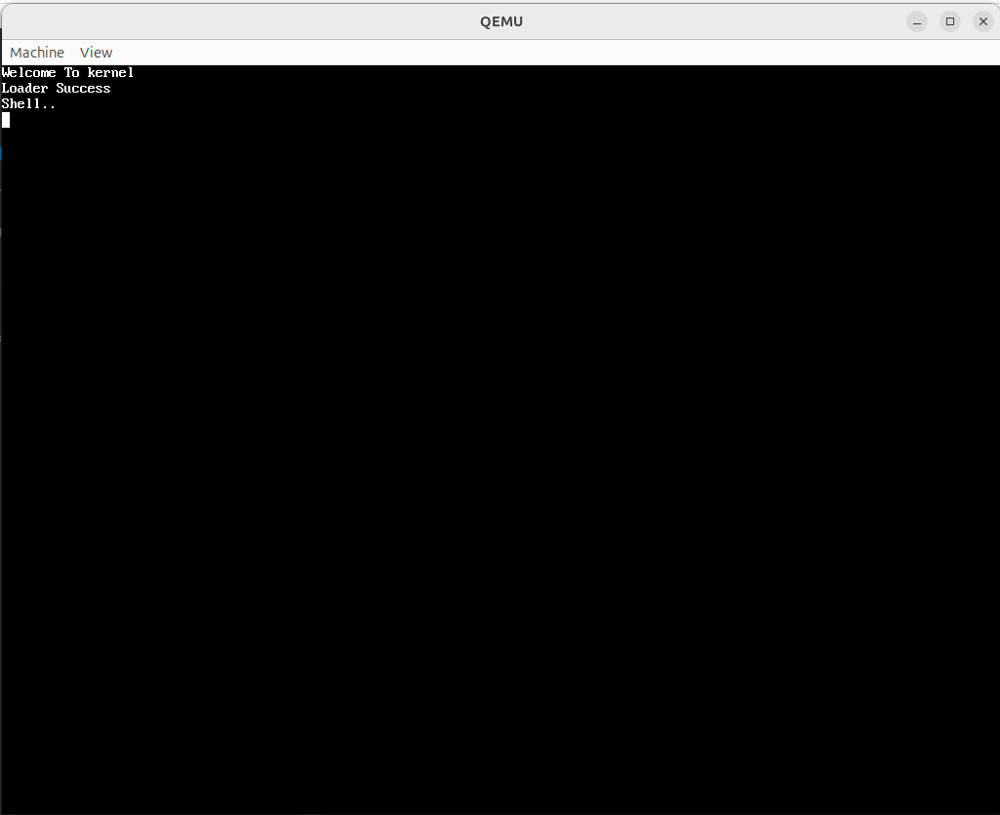

# Operating System

A simple operating system built in **C**, designed for the **x86 32-bit architecture**.  
It includes core components such as a file system, memory management, threading, and basic I/O device support.  
The system is compiled using `make` and tested with **QEMU**.

> This project uses the [OSDev Wiki](https://wiki.osdev.org/Creating_an_Operating_System) as a primary reference.

---

## ⚙️ Features

- **File System**  
  Basic file storage and access mechanisms.

- **Memory Management**  
  Includes paging and virtual memory support.

- **Threading & Scheduler**  
  Cooperative or preemptive threading with a simple scheduling mechanism.

- **Multi-Processor Support**  
  Basic Multi-Processing support.

- **Device Input/Output**  
  Mouse and keyboard driver implementations.

- **System Calls**  
  Interface for user programs to access kernel-level services.

- **Interrupt Handling**  
  Support for hardware and software interrupts.

- **Screen Output**  
  Print text directly to the screen.

- **User Standard Library**  
  Provides basic standard library functions for user programs.

---

## 🛠 Build & Run

- Built using `make` with custom Makefiles.
- Tested using [QEMU](https://www.qemu.org/), a fast and open-source system emulator.

---
### BIOS Run
```
make bios_run
```

### UEFI Run
1. Set LOOPN in Makefile.img to appropriate value
2. Run
```
make run
```

## Screenshots
- BIOS

- UEFI
